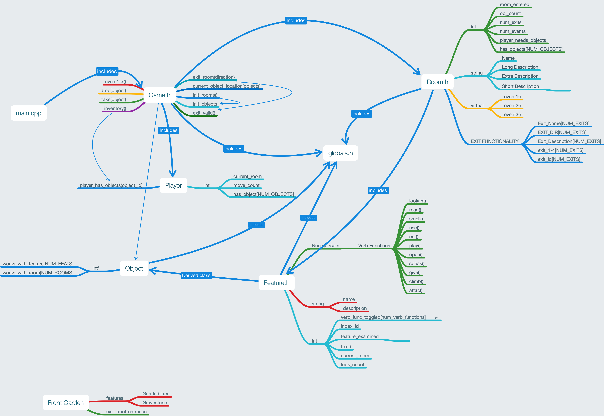

- run "make" to compile
- run "make clean" to clean outputs 

# Engine/DS

## Dependencies
You can refer to the makefile, or, if you prefer, the following graph for an understanding of the dependancies. 

## Rooms
There are 15 rooms.

> Room DS Visualization Here

### Object Text within Room Descriptions
Object text is added in the Game class via the `add_object_text()` function after the object is set to be in that particular room via `set_has_object()`. The above are done within the `init_rooms()` class, which also sets each individual room within a room array, so that it is easy to refer to via index. The Game class also houses the objects, which are referred to within the Room classes by their index, which is also set within the room class by id. 

## Objects

There are 8 Objects

> Object DS Visualization here

## Features

There are 30 Features

### Feature 12: Dollhouse
#### run_func(DOLLHOUSE, DOLL, USE)
- returns: 41
- triggers: event14()  in Game.cpp

> Feature DS Visualization here

## Player

There is one player.

The player has a `int move_count`. This is used by the Game class to trigger Game events. It is incremented every time a player successfully exits a room. It starts at '1'. 
> At move_count==3, i.e. at the 3rd room, the Player Friend Dissapears event occurs. 
> Player DS Visualization here

## Game

> Game DS Visualization here
> Explain how Game calls and interacts with Rooms, Verbs, Features, Objects, and the Player

### Game Events

#### event14()
At midnight, the crypt opens. This event causes the clock to go back by one hour, giving you an extra move. 

#### event15()
If you play the music in the bathroom to the creature in the mirror, this is the first act to unlock the ability to take blood from the sink, to give to the vampire later, to reunite the ghost family. 

#### event16()

If you use the dagger in the bathroom to make a sacrifice of your blood, this is the seocn act to unlock the ability to take blood from the sink, to give to the vampire later, to reunite the ghost family. 

## Verb Functions

> Explain return value and parameters verbs tak

## State Saving

### Event Arrays
Event arrays are utilized within the Game glass to keep track of what events have veen triggered

> array tracking 45 events to

### Integer States
The Player `int current_room` saves what room the player is currently in.
The Player `int has_objects[NUM_OBJECTS]` saves what items the player currently has
The Room `int has_objects[NUM_OBJECTS]` saves what items the room currently has 

## Tests

# Parser

# Save/Load
