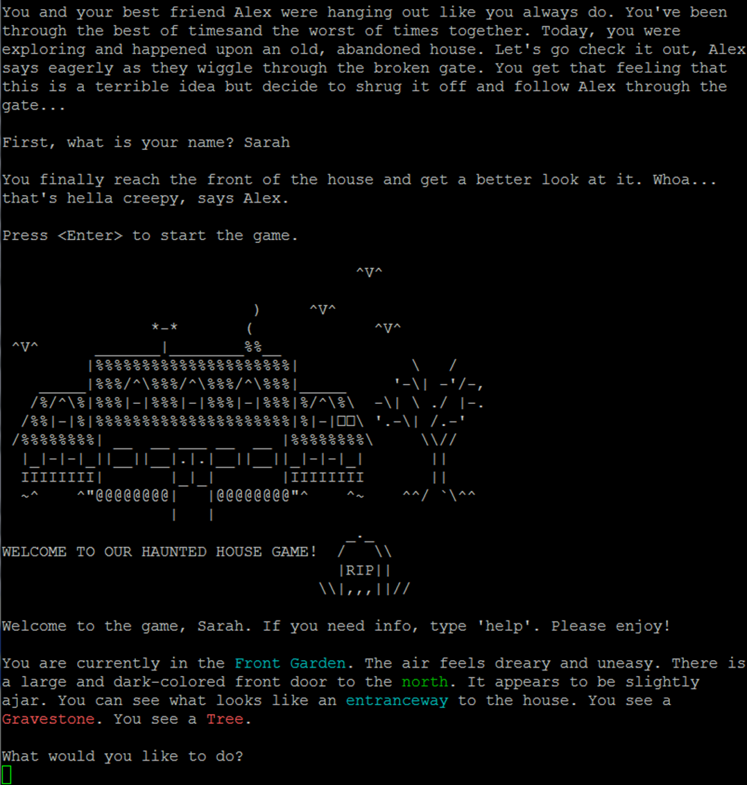

# Haunted House Adventure Game Senior Project
This is a fork of our group's project and is intended to be used for portfolio purposes.

 

## Project Description
The theme of the game is a mild dark and psychological horror with some occasional creative
tints of comedy and silliness. For comparison, the theme can be closely compared to the board
game Betrayal at House on the Hill.

From the perspective of the end user (the player), our game objective is to instill a bit of
suspense and excitement in the player and to motivate them to interact with the features in each
room as they are driven by the story goal. The user will find that they are able to gain clues and
information as they interact with room features and objects. In order to perform this, the user
can interact with the game using a mixture of pre-defined verbs and nouns describing the
features, objects, and directions within the room.

Using our thoroughly written and descriptive text, the user should be able to use their
imagination to envision the adventure that the words describe. Certain features in the room are
printed in a different text color to serve as a hint for the player.

There are 15 rooms in the haunted house, and each room has two “features” to be examined
and interacted with by the player. When the player enters a room for the first time, the game will
print a long-form description of the room, including directions you can go and what features
there are to interact with. Throughout the house there are also 8 objects that the player can
acquire and place into their inventory.

The user interacts with the environment though text input, using verb that are predefined, such
as look, take, eat and climb. There is a help function that can be called to display what verbs
can be used, or at least tried.

At any time the user can save the game or load a valid game file.

## How to install the game
Note: This game was made to run on OSU's Linux servers. There is no guarantee that it will run perfectly 
in other environments, but there is a chance it will run on on other Linux distributions.

### Log onto the school flip server
-  Ensure your flip terminal window size is at least 100 columns.
- Upload zip FeelingRoomy.zip 
- Unzip the files
- Run `make` 
- Run ./main

To clean .o's, `make clean`

## Requirements
We were required to meet the following requirements while designing and implementing this project:

- Rooms
  - Your game must have at least 15 "rooms" (beach, basement, dungeon cell, cyberspace virtual reality area, plane of existence, emotion, etc.).
  - Each room must have at least two "features" that can be examined (a fish on the ground, lightning bolts in the sky, a wooden chair, a smoky smell, etc.).
  - Room descriptions:
    - When you go into a room for the first time, the game must print a long-form description of the room (a paragraph, say).
    - When entering the room at a later time, a short-form description should be used instead. This takes up less space then repeating the entire long-form description when you move back to that room.
    - You can also have additional explanations after the long or short-form description that talk about something that happens to occur while you're there (e.g. "A train whistle sounds across the lonely field").
    - Exits from a room must be described in both the short-form and long-form descriptions, and should include a direction. For example: "There is a dank-smelling staircase, descending into the dark, at the end of the hall on the north wall", or "I can see clouds to the east and west that I think I can jump to from here".

- Objects
  - There must be at least 8 objects that you can acquire to your player inventory that have an effect on the game (e.g. a lamp that allows you to proceed safely down a dark corridor, a key that unlocks a car trunk, etc.).
  - These objects must be droppable in any room and should stay there, to perhaps be picked up later. Note that this can be overridden fictionally for some areas: lava-filled rooms for example may not allow the player to drop objects, or dropping crumbs of bread in a garden might cause them to be eaten or moved by birds, and thus changed the next time you come through.
  - Consider having some verbs (see below) combine or affect features and/or items ("use key on lock", "spread butter on toast", "put gem on staff", etc.).
  
- Verbs
  - Your game must support an action vocabulary space (verbs) of at least ten primary actions (hit, pull, go, eat, etc.). These verbs must allow interaction with each feature in each room (a generic "you can't eat that" type of message is OK to use with some verbs).
  - Some verbs must cause the player to move between rooms.
  - In addition to the other 10 action verbs, the following verbs and phrases MUST also be supported - no exceptions:
    - look :: repeats the long form explanation of the room.
    - look at <feature or object> :: gives a fictionally interesting explanation of the feature or object. You should be able to "look at" objects in your inventory, as well. If you describe something in your text descriptions, you should be able to "look at" it to examine it.
    - "go north" OR "north" OR "go dank-smelling staircase" OR "dank-smelling staircase" :: proceed through the indicated exit to the next room (note that ALL FOUR of these forms of movement are required, and thus require you to describe the exits appropriately). You might also decide to implement other room-travel verbs such as "jump north" as appropriate.
    - take :: acquire an object, putting it into your inventory.
    - help :: list a set of verbs the game understands. You do not have to list all of the verbs your game understands, in case you want to keep some fictionally hidden ("fly up" [the player didn't realize he had wings the entire time], "think about french fries", "polymorph into toaster", etc.).
    - inventory :: Lists the contents of your inventory.
  - Spend time coming up with a natural language parser that is able to handle prepositions such as "about", "on", "onto" "above", and "into". Having this kind of extended parser really makes the world come alive, but will require some time.
  - You should include aliases for common verbs. For example allow "grab" and "pick up" to do the same thing as "take" (but you still must implement "take").
  
- You must implement a save system using these two verbs:
  - savegame :: saves the state of the game to a file.
  - loadgame :: confirms with the user that this really is desired, then loads the game state from the file.
